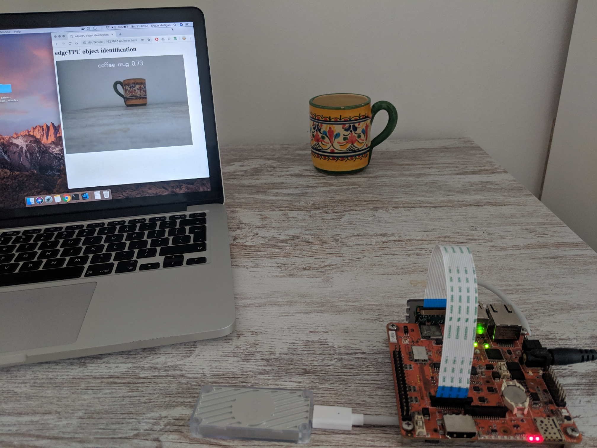

### Web Streaming Edge TPU Classification on BalenaFin

Streams a video feed on port 80 while doing continuous image classification based on the ImageNet data set and inception v2 model, but can be easily swapped out with any other tflite model provided it meets the [TPU model requirements](https://coral.withgoogle.com/docs/edgetpu/models-intro/).

This repository provides an example that sets up the [Coral edge TPU USB accelerator](https://coral.withgoogle.com/products/accelerator/) so that it can be used from within a container running on balenaOS on the balenaFin.

The server streams on port 80, and has basic authentication. The default user and password is `balena`.

`Dockerfile` and `run.sh` have quite a few comments regarding the installation of various libraries the coral usb needs.

The webstreaming code was heavily borrowed from [@lemariva great blog post](https://lemariva.com/blog/2019/04/edge-tpu-coral-usb-accelerator-dockerized).

#### Some notes:
- libusb is used to communicate with the device.
- The device supports USB 3.0 but the Pi/Fin have USB 2.0 which will be the bottleneck.
- Google's installation script detects the platform and installs the relevant libraries. The platforms detected are only pi3/pi3b+ via the device tree model string. So need to 'tweak' the script a bit to run on the balena Fin
